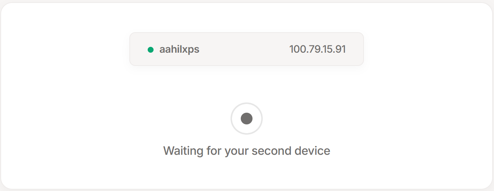
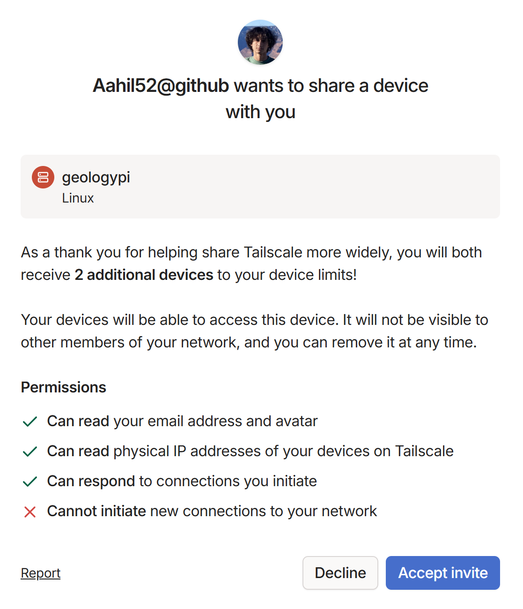
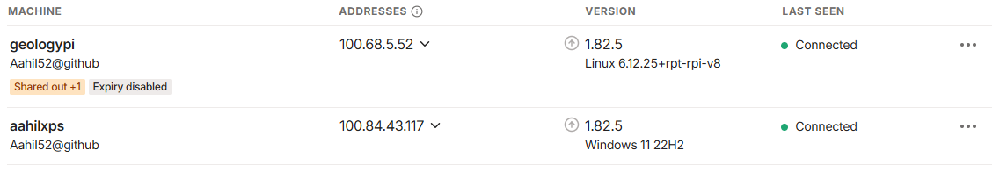

# Remotely Access the Sensor System via Tailscale

We will be using Tailscale to easily SSH into and remotely program the Raspberry Pi based sensor system while it is deployed at the water treatment facility.

This guide shows you how to connect to the deployed Raspberry Pi sensor system using Tailscale. Once connected, you'll be able to SSH into the system from anywhere in the world.

## Step 1: Create a Tailscale Account

### [login.tailscale.com](http://login.tailscale.com)


## Step 2: Follow the Prompts to Install Tailscale and Add Your First Device

Install Tailscale on the device you would like to SSH from.



Your device should appear on the screen like this once connected.

## Step 3: Skip the Rest of the Introduction


Tailscale will prompt you to add a second device. Scroll to the bottom of the page and click “Skip this introduction →”.

## Step 4: Accept Invite for `geologypi`

### https://login.tailscale.com/admin/invite/Aj5S8qTGjk9Gw7CtGuZQ11



Navigate to the invite link and click “Accept invite”.



Once you accept the invite, you should now have two machines listed in your Tailnet.

## Step 5: Test Your Connection

Test your connection with the following commands.

```bash
$ tailscale status
100.84.43.117   aahilxps                          Aahil52@     windows -
100.68.5.52     geologypi.elephant-city.ts.net    Aahil52@     linux   active; direct 172.20.5.82:41641, tx 6009476 rx 9551760
```

```bash
$ ping geologypi.elephant-city.ts.net
Pinging geologypi.elephant-city.ts.net. [100.68.5.52] with 32 bytes of data:
Reply from 100.68.5.52: bytes=32 time=8ms TTL=64
Reply from 100.68.5.52: bytes=32 time=10ms TTL=64
Reply from 100.68.5.52: bytes=32 time=12ms TTL=64
Reply from 100.68.5.52: bytes=32 time=8ms TTL=64

Ping statistics for 100.68.5.52:
    Packets: Sent = 4, Received = 4, Lost = 0 (0% loss),
Approximate round trip times in milli-seconds:
    Minimum = 8ms, Maximum = 12ms, Average = 9ms
```

If `tailscale status` does not show `geologypi.elephant-city.ts.net` or `geologypi.elephant-city.ts.net` does not resolve, ensure that Tailscale is running and `geologypi` was correctly added to your Tailnet.

## Step 6: SSH into `geologypi`

You can now SSH into the sensor system using the following command. The password is `water`.

```bash
$ ssh water@geologypi.elephant-city.ts.net
water@geologypi.elephant-city.ts.net's password: water
```

## Summary

- You now have secure SSH access to the Raspberry Pi sensor system via Tailscale.
- Make sure that Tailscale is running on your device before you attempt to SSH into the sensor system.
- Use `ssh water@geologypi.elephant-city.ts.net` to connect while the sensor system is online.
- You can now use tools like VS Code Remote SSH or SCP to develop and transfer files directly.

Need help? Reach out to Aahil.